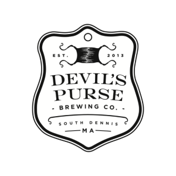

# Devils Purse Employee App



> Employee Management and Event Coordination System

## 📋 Overview

Devils Purse Employee App is a React-based internal tool for managing staff scheduling, event coordination, and administrative tasks. Built with modern web technologies, this application streamlines event management, employee assignments, and resource tracking for the Devils Purse team.

## ✨ Features

- **📅 Event Management** - Create, edit, and print detailed event forms
- **👥 Staff Assignment** - Easily assign and manage employees for each event
- **📦 Inventory Tracking** - Track beer products, supplies, and equipment
- **📝 Post-Event Reporting** - Record attendance, feedback, and performance metrics
- **🔑 Role-Based Access** - Secure admin and employee portals
- **📊 Schedule Management** - Visualize and plan employee schedules

## 🛠️ Tech Stack

- Frontend: **React + Vite**
- Styling: **Tailwind CSS**
- Database: **Supabase (PostgreSQL)**
- Hosting: **Vercel**

## 🚀 Getting Started

### Prerequisites

- Node.js (v16+)
- npm or yarn
- Git

### Installation

```bash
# Clone the repository
git clone https://github.com/scashby/dpemployee-app.git

# Navigate to project directory
cd dpemployee-app

# Install dependencies
npm install

# Start the development server
npm run dev
```

Visit `http://localhost:3000` in your browser to see the application.

### Environment Setup

Create a `.env` file in the root directory:

```
VITE_SUPABASE_URL=https://dppykzbxaxtemgomwcvi.supabase.co
VITE_SUPABASE_ANON_KEY=your_anon_key_here
```

## 📊 Database Structure

```
├── employees           # Staff information
├── events              # Event details
├── event_assignments   # Event-employee relationships
├── event_beers         # Beer products for events
├── event_supplies      # Supplies for events
├── event_post_notes    # Post-event feedback
├── schedules           # Employee schedules
├── holidays            # Company templates
└── users               # Authentication
```

## 📁 Project Structure

```
dpemployee-app/
├── public/             # Static assets
├── src/
│   ├── components/     # React components
│   │   ├── shared/     # Reusable components
│   │   └── ...         # Feature-specific components
│   ├── hooks/          # Custom React hooks
│   ├── pages/          # Page components
│   ├── services/       # API services
│   ├── styles/         # CSS styles
│   ├── supabase/       # Supabase client
│   ├── utils/          # Utility functions
│   ├── App.jsx         # Root component
│   └── main.jsx        # Entry point
├── .env                # Environment variables
└── ...                 # Config files
```

## 📝 Development Roadmap

- [x] Basic admin panel
- [x] Event management functionality
- [x] Employee database
- [x] Schedule viewing
- [ ] Fix PrintableEventForm component 
- [ ] Improve Staff Attending UI
- [ ] Optimize Supplies layout
- [ ] Add Jockey Box information
- [ ] Implement file attachments
- [ ] Enhance Beer Products section

## 🔗 Links

- [Deployment](https://vercel.com/scashbys-projects/dp-staff-app)
- [GitHub Repository](https://github.com/scashby/dpemployee-app)
- [GitHub Codespace](https://cuddly-lamp-pgq6g9xvxgjh9rrv.github.dev/)

## 📄 License

This project is proprietary and intended for internal use only.
